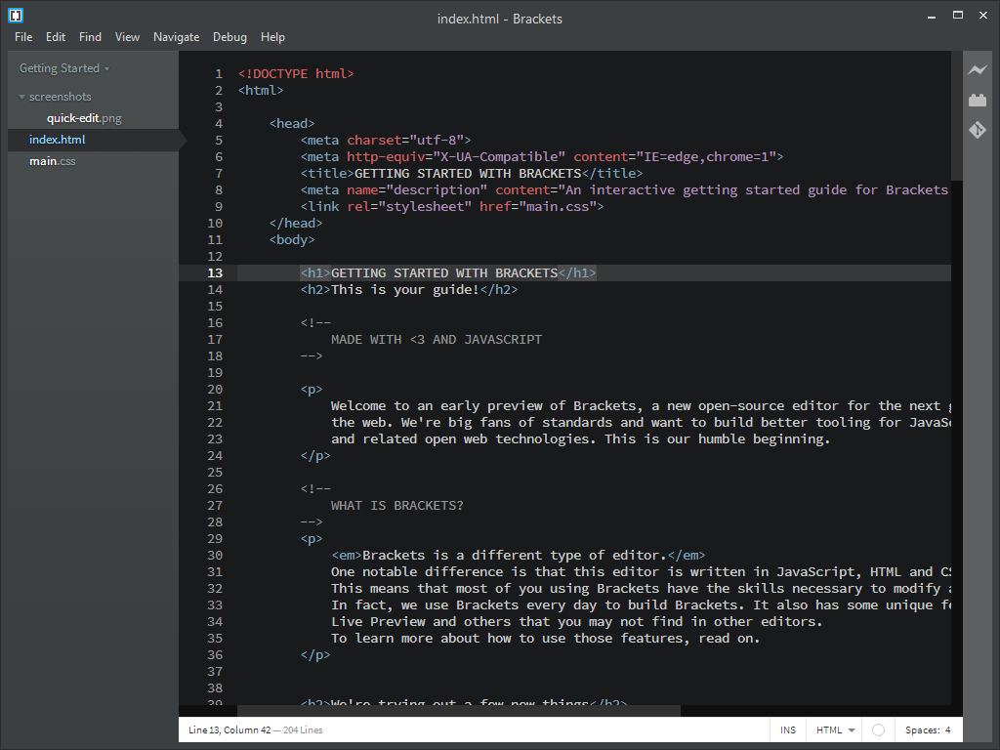
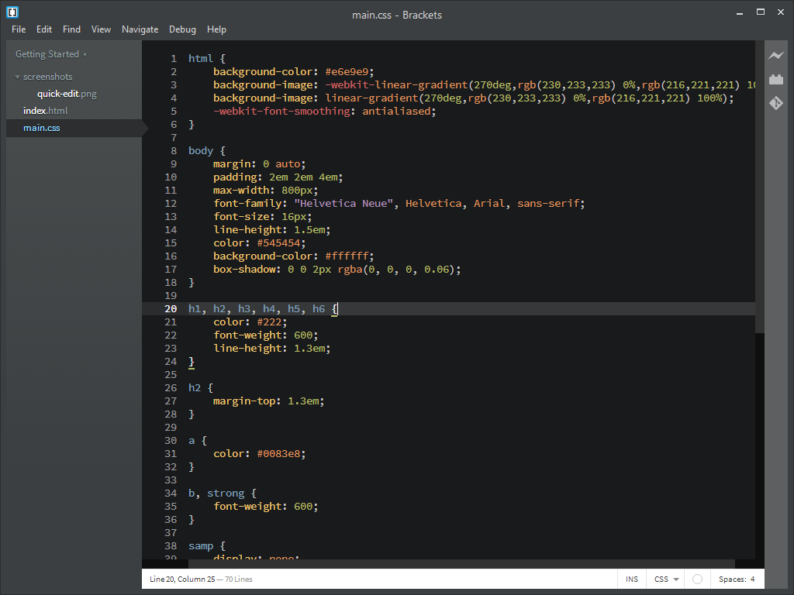
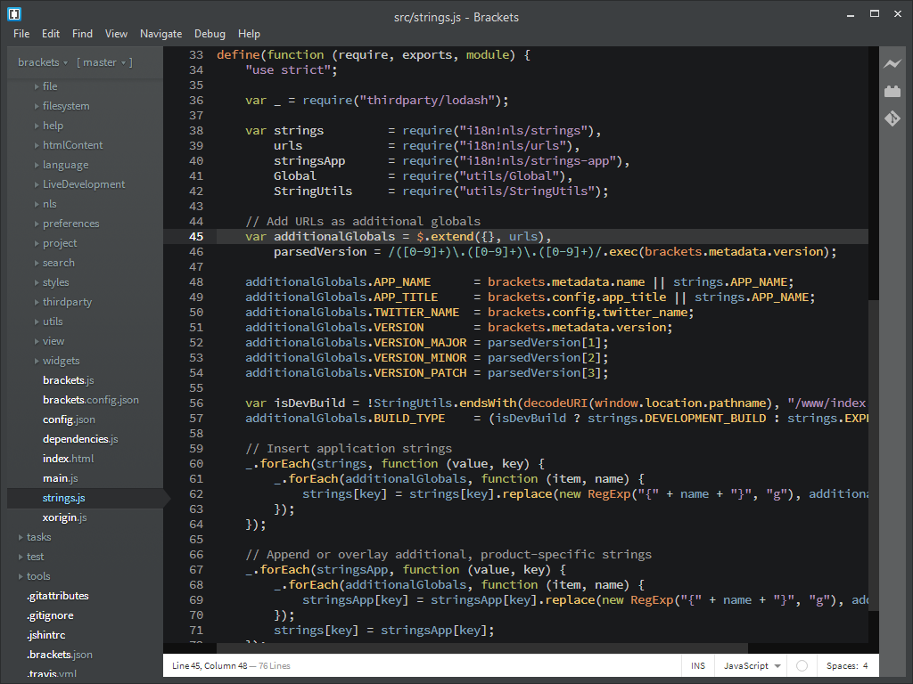

# Quick Dark

A dark theme for [Brackets](http://brackets.io/) that makes your code pretty and readable.

## HTML

## CSS

## JavaScript

## Attribution
This theme is based on [Easy Dark](https://github.com/Brackets-Themes/EasyDark), a rendition of the [Tomorrow Theme](https://github.com/chriskempson/tomorrow-theme).

## Copyright and License
Copyright (c) 2014 [Increment Web Services](http://incrementwebservices.com/). Released under the [MIT License](LICENSE).
